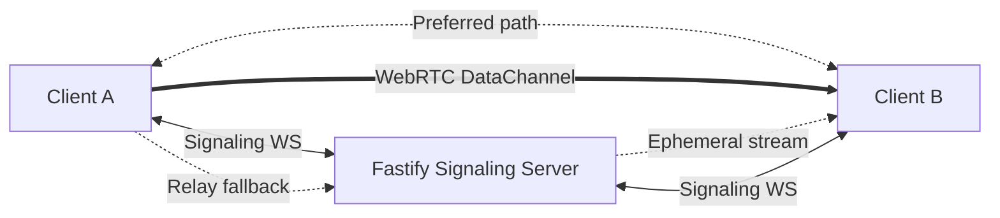

<p align="center">
  
</p>

<p align="center">
  <a href="https://github.com/abhie7/signal-share/blob/main/LICENSE"></a>
  <a href="https://github.com/abhie7/signal-share"></a>
  <a href="https://github.com/abhie7/signal-share/issues"></a>
  
  
  
</p>

# SignalShare

SignalShare is an open-source, privacy-first file transfer app that sends files directly between devices when possible (WebRTC), and falls back to an ephemeral in-memory relay when needed.

No account wall. No cloud drive. No permanent file storage.

## Why SignalShare

- Real peer-to-peer transfer on local networks.
- Remote fallback when direct paths are blocked.
- In-memory relay stream with automatic cleanup.
- Local transfer history stored on your own device (IndexedDB).
- Single-process server model: Next.js app + Fastify API/WebSocket backend.

## Highlights

- Nearby peer discovery over WebSocket signaling.
- Join by short transfer code or shareable link.
- QR code session sharing.
- Global drag-and-drop and folder upload (auto-zipped client-side).
- Transfer progress with status transitions and error cards.
- Theme toggle, sound feedback, confetti completion UX.

## Architecture



### Transport Strategy

- `local` mode: direct WebRTC DataChannel transfer (same subnet).
- `remote` mode: server-assisted relay stream (`/api/transfer/:id/download`) with chunk/progress events.

## Tech Stack

- Frontend: Next.js 16, React 19, Tailwind CSS 4, Framer Motion, Zustand.
- Backend: Fastify 5, `@fastify/websocket`, `@fastify/cors`.
- Runtime: TypeScript end-to-end.
- Utilities: `jszip`, `nanoid`, `idb`, `node-cron`.

## API Surface

### HTTP

- `GET /health` -> service status payload.
- `GET /api/transfer/:id` -> session metadata.
- `GET /api/transfer/:id/download` -> SSE chunk stream for relay mode.
- `GET /api/transfer/:id/progress` -> SSE progress stream.

### WebSocket (`/api/ws`)

Core message families implemented in `server/routes/ws.ts`:

- Session lifecycle: `create-session`, `join-by-code`, `join-by-link`, `send-to-peer`, `accept-transfer`, `decline-transfer`.
- WebRTC signaling relay: `rtc-offer`, `rtc-answer`, `rtc-ice-candidate`, `receiver-rtc-ready`.
- Transfer channel: `file-chunk`, `file-chunk-end`, `transfer-progress`, `transfer-complete`, `transfer-cancel`, `transfer-error`.
- Presence and identity: nearby peers broadcast + `update-identity`.

## Getting Started

### Prerequisites

- Node.js 20+
- npm

### Run Locally

```bash
git clone https://github.com/abhie7/signal-share.git
cd signal-share
npm install
npm run dev
```

Open `http://localhost:3000`.

### Production

```bash
npm run build
npm start
```

## Environment Variables

- `PORT`: Server port, defaults to `3000`.
- `HOST`: Public host used in generated share links.
- `NODE_ENV`: `production` enables periodic health pings.

## Available Scripts

- `npm run dev`: Runs the unified dev server (`tsx watch server/index.ts`).
- `npm run build`: Builds Next.js app.
- `npm start`: Starts production server.
- `npm run lint`: Runs ESLint.

## Project Layout

```text
app/           Next.js routes (home, docs, changelog, history, receive)
components/    UI and transfer experience components
hooks/         Transfer, WebRTC, relay, websocket coordination hooks
lib/           Stores, db/history, utility modules
server/        Fastify server + API routes + websocket signaling
webrtc/        WebRTC peer/file chunking helpers
utils/         Cross-cutting helpers (zip, etc.)
```

## Security and Privacy Notes

- No account or identity provider integration.
- No persistent server-side file storage.
- Relay payloads are streamed via memory callbacks and cleaned after transfer.
- Local history remains in browser IndexedDB under user control.

## Roadmap Snapshot

- [x] LAN WebRTC transfers.
- [x] Relay fallback mode.
- [x] Transfer history page.
- [x] QR-based session sharing.
- [x] Responsive transfer screen refresh.
- [ ] TURN/STUN configurability for enterprise NAT environments.
- [ ] End-to-end cryptographic verification indicators per transfer session.

## Contributing

Contributions are welcome.

1. Fork the repository.
2. Create a feature branch (`feat/my-feature`).
3. Commit with clear messages.
4. Open a pull request with context, screenshots, and test notes.

Please check open issues first for alignment.

## Documentation

- In-app architecture docs: `/docs`
- In-app changelog timeline: `/change-logs`

## License

MIT - see `LICENSE`.
